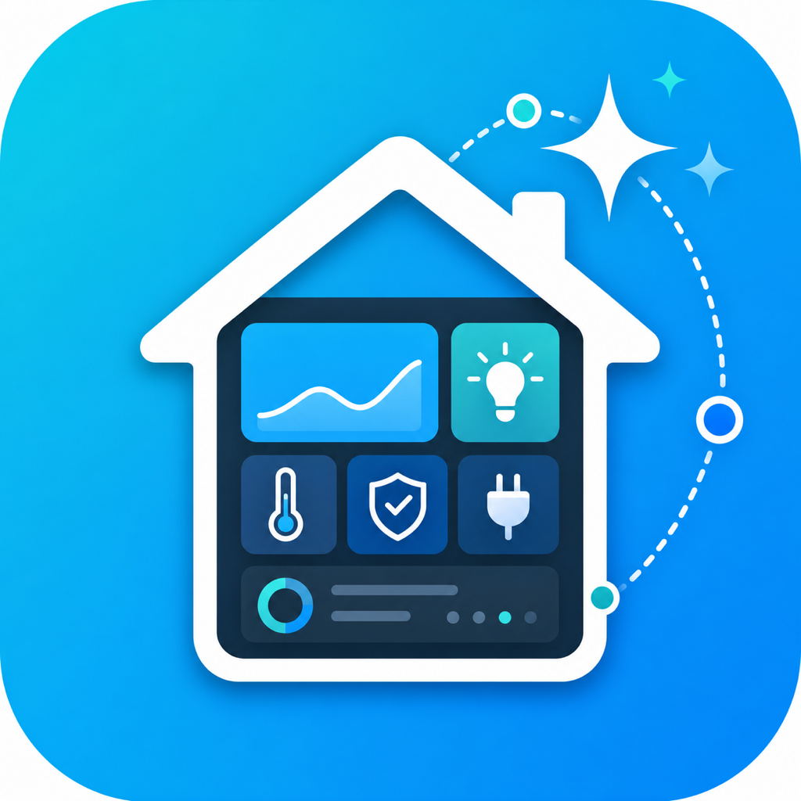

# UrDash



UrDash is a HACS-installable Home Assistant custom integration that helps create polished Lovelace dashboards from a natural-language request and the entities already available in Home Assistant.

It adds a native Home Assistant sidebar panel where users can:

- Describe the dashboard they want.
- Analyze current Home Assistant entities.
- Generate Lovelace YAML.
- Preview the proposed layout.
- Copy the dashboard YAML into a manual Lovelace dashboard.
- Generate a new Lovelace tab/view using an existing dashboard as reference.
- See recommended custom-card packages for richer designs.

## Install With HACS

Until UrDash is published as a default HACS repository, add it as a custom repository:

1. Open HACS.
2. Open the three-dot menu and choose **Custom repositories**.
3. Add this repository URL.
4. Select **Integration** as the category.
5. Install **UrDash**.
6. Restart Home Assistant.
7. Go to **Settings → Devices & services → Add integration** and add **UrDash**.

After setup, UrDash appears in the sidebar.

## AI Setup

During setup, users can choose:

- `openai` to use their own OpenAI API key.
- `local` to use the built-in non-AI generator.

The API key is entered in Home Assistant's integration setup or options flow. It is used only by the Home Assistant backend and is never sent to the UrDash frontend panel.

Defaults:

- Provider: `openai`
- Model: `gpt-5.2`
- Base URL: `https://api.openai.com/v1`

The base URL can be changed for OpenAI-compatible providers. If the AI request fails or no key is configured, UrDash falls back to the local generator and shows the warning in the panel.

## Reference Dashboard Mode

UrDash defaults to a non-destructive workflow for existing dashboards:

1. Paste the current Lovelace dashboard YAML or JSON into the reference field.
2. Keep generation mode set to `new tab`.
3. Describe the modification you want.
4. UrDash generates one new Lovelace view/tab.

The reference dashboard is used only as context for style, structure, and existing view paths. UrDash does not write to Home Assistant storage and does not modify the source dashboard. The generated YAML is a view snippet that should be appended as a new tab after review.

## Recommended Lovelace Cards

UrDash can generate YAML that uses these optional custom cards:

- Mushroom Cards
- Bubble Card
- button-card
- mini-graph-card
- card-mod

HACS integrations cannot declare other HACS frontend cards as hard dependencies. UrDash treats them as dashboard recommendations and can fall back to built-in Home Assistant cards when custom cards are disabled.

## Services

UrDash also exposes `urdash.generate_dashboard`. The service generates a dashboard draft from the current Home Assistant state registry and fires an `urdash_dashboard_generated` event containing the generated dashboard object and YAML.

Service fields:

- `request`: natural-language dashboard request.
- `style`: `modern`, `minimal`, `glass`, or `compact`.
- `allow_custom_cards`: whether generated YAML may use recommended custom cards.
- `use_ai`: whether to call the configured AI provider.
- `mode`: `new_view` for a new tab, or `dashboard` for a full dashboard draft.
- `reference_dashboard`: optional existing dashboard YAML used as context only.

## Development Layout

```text
custom_components/urdash/
  __init__.py
  config_flow.py
  const.py
  generator.py
  manifest.json
  services.yaml
  frontend/urdash-panel.js
  translations/en.json
```

This repository is now shaped as a HACS custom integration, not a Home Assistant add-on. It does not require Home Assistant OS.
